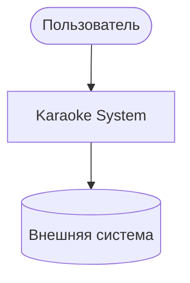

# L1 — System Context

> **Статус**: плейсхолдер. Содержимое будет перенесено из
> `livedocs/architecture/L1-system-context.md` в следующих
> спецификациях.

Здесь будет mermaid-диаграмма C4 L1: где Karaoke находится в мире,
с какими внешними системами взаимодействует, кто пользователи.

Шаблон:

