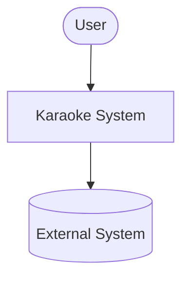

# System (C4 L1 + L2)

> **Статус**: в разработке. Каркас развёрнут в
> `320-living-docs-v2-bootstrap`. Наполнение ведётся в следующих
> спецификациях.

C4-модель верхнего уровня:

- **L1 — System Context** ([`01-context.md`](01-context.md)): место системы
  Karaoke в мире: внешние актёры, внешние системы, граница.
- **L2 — Containers** ([`02-containers.md`](02-containers.md)): технические
  контейнеры внутри границы (Kotlin/Spring backend, Vue 3 SPA, PostgreSQL,
  MinIO, MLT-пайплайн и т.д.).

Детализация L3 находится в `docs/domains/<name>/components/*.md`.

## Шаблон

## Связь с L3

- Каждый контейнер на L2 раскрывается одним или несколькими
  доменами на L3: см. `docs/domains/<name>/domain.md`.
- Каждый домен на L3 ссылается на те контейнеры L2, в которых он
  физически реализован.
