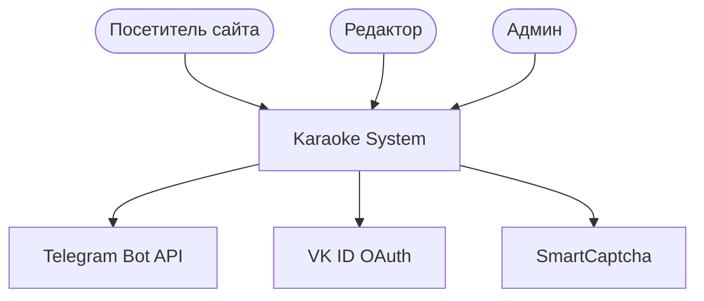
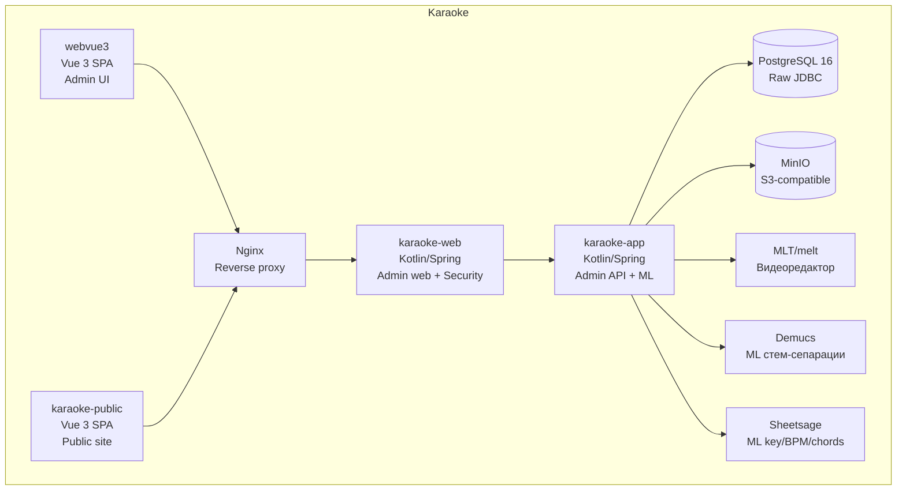

# C4 Overview — Karaoke

> **Домен**: `knowledge/public/`
> **Назначение**: краткая C4-диаграмма Karaoke для неинженеров и
> быстрого обзора. Детальные диаграммы — в `knowledge/system/` и
> `knowledge/domains/<name>/components/`.

## L1 — System Context

Karaoke — это автоматизированный конвейер производства караоке-видео
из обычных MP3. На входе — MP3-файлы, на выходе — готовое караоке-видео
с маркерами и текстом.

**Внешние актёры**:

- **Посетитель сайта** — читает каталог, слушает песни.
- **Редактор** — обрабатывает песни (Pass 51+, см. [identity](../domains/identity/domain.md)).
- **Админ** — управляет каталогом, настраивает рендер.
- **Telegram** — авто-новости о новых песнях.
- **VK ID** — OAuth для регистрации.
- **SmartCaptcha** — капча на критических формах.

## L2 — Containers

**Контейнеры**:

- **`karaoke-app`** — Kotlin/Spring admin API + ML-пайплайн (Demucs,
  Sheetsage, melt).
- **`karaoke-web`** — Kotlin/Spring web для админки, Spring Security.
- **`webvue3`** — Vue 3 SPA для админки (Bootstrap-vue-next).
- **`karaoke-public`** — Vue 3 SPA для публичного сайта (Bootstrap 5).
- **PostgreSQL 16** — основная БД (raw JDBC, без JPA/Hibernate).
- **MinIO** — S3-compatible storage для стемов, MP4, картинок.
- **MLT/melt** — внешний видеоредактор (см. [ADR-0002](../adr/0002-mlt-instead-of-ffmpeg.md)).
- **Demucs, Sheetsage** — внешние ML-модели (см. [ADR-0005](../adr/0005-self-hosted-ml.md)).
- **Nginx** — reverse proxy (конвенции конфигурации — см. `knowledge/guidelines/architecture-conventions.md`).

## L3 — Components (краткий обзор)

Каждый контейнер содержит компоненты, описанные в `knowledge/domains/<name>/components/*.md`.
Полная версия — там. Здесь — **карта компонентов по контейнерам**:

### `karaoke-app`

- **Controllers** (admin API endpoints).
- **Services** (бизнес-логика: `SongService`, `SiteUserService`, `StatsService`).
- **Workers** (`KaraokeProcess` — Demucs, Sheetsage, MLT).
- **Repositories** (raw JDBC).
- **Models** (Kotlin data classes).

### `karaoke-web`

- **Controllers** (`PublicSongEditorController` для редакторов).
- **Security** (`SecurityConfig` — Spring Security, см.
  [security-config](../domains/identity/components/security-config.md)).
- **Templates** (Thymeleaf для admin UI).

### `webvue3`

- **Pages** (`Songs/`, `Albums/`, `Authors/`, `Reviews/`, ...).
- **Store** (Vuex modules: stats, songs, ...).
- **Components** (`SongsTable.vue`, `ReviewModal.vue`, ...).

### `karaoke-public`

- **Pages** (`HomeView`, `SongView`, `AlbumView`, ...).
- **Store** (Vuex модули).
- **Components** (`Player.vue`, `Lyrics.vue`, `StatsView.vue`).

### PostgreSQL

- **`tbl_settings`** (legacy name для песен, 18k+ записей).
- **`tbl_albums`**, **`tbl_authors`**, **`tbl_genres`**.
- **`tbl_song_assignments`** (editorial).
- **`tbl_review_tasks`** (editorial).
- **`tbl_events`** (stats).
- **`tbl_subscriptions`** (publishing).
- **`tbl_pictures`** (catalog).
- и др.

### MinIO

- `stems/<songId>/{vocals,accompaniment,drums,bass,other}.flac`.
- `done_files/<songId>/<version>.mp4`.
- `frames/<songId>/<ms>.jpg`.

## Связанные документы

- [knowledge/domains/](../domains/) — полные определения доменов.
- [knowledge/system/](../system/) — детальные C4-диаграммы (L1, L2).
- [knowledge/adr/](../adr/) — архитектурные решения.
- [knowledge/glossary.md](glossary.md) — глоссарий терминов.
