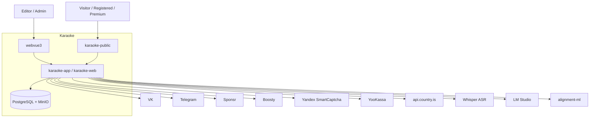

# L1 — System Context

> **Статус**: Active (Pass 356). C4 L1 — где Karaoke находится в мире,
> с какими внешними системами взаимодействует, кто пользователи.

## Актёры (пользователи)

| Актёр | Роль | Использует |
|---|---|---|
| **Editor** | Редактор караоке-песен | `webvue3` (admin) — берёт песни в работу, расставляет маркеры, утверждает рендер. |
| **Admin** | Администратор проекта | `webvue3` (admin) — управляет тарифами, словарями, health-репортом, schedulers, sync. |
| **Visitor** | Посетитель сайта (аноним) | `karaoke-public` — смотрит/слушает песни, Закрома, лидерборд. |
| **Registered User** | Зарегистрированный пользователь | `karaoke-public` + личный кабинет (плейлисты, подписки, StemJob). |
| **Premium User** | Premium-подписчик | + премиум-песни, StemJob (создать минусовку), VK Boosty. |

## Внешние системы

| Система | Что | Когда используется |
|---|---|---|
| **VK (ВКонтакте)** | Публикация постов + фото в группу VK | `VkAutoPublishScheduler` (60s), `VkPhotoUploadClient` (upload обложки), `VkPreviewWarmupClient` (прогрев preview). |
| **Telegram** | Bot API — авто-публикация в TG-канал, чтение channel_post | `TelegramAutoPublishScheduler` (60s), `TelegramUpdatesConsumer`. |
| **Sponsr** | Скрапинг постов автора | `SponsrSyncScheduler` (12h). |
| **Boosty** | Платёжный шлюз (НЕ через YooKassa — отдельная интеграция) | Premium-публикации, `PremiumAutoPublishScheduler` (30s). |
| **Yandex SmartCaptcha** | Защита от ботов | `YandexCaptchaValidationService` (per login/register). |
| **YooKassa** | Платёжный шлюз для подписок | `PaymentService` (per checkout). |
| **GeoIP (api.country.is)** | Определение страны по IP | `GeoIpService` (per событие). |
| **Whisper ASR** | Распознавание речи (local) | `WhisperAsrService` (per forced-alignment). |
| **LM Studio** | Локальная LLM (LAN) | `LmStudioService` (per запрос). |
| **forced-alignment ML (alignment-ml)** | Выравнивание текста по аудио (CTC) | `AlignmentServiceClient` (per задание). |

## Mermaid C4 L1

## Changelog

- **Pass 356** (2026-09-09): Initial C4 L1. Автор: agent (Karaoke).