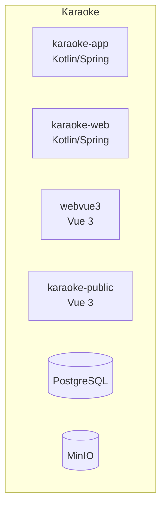

# L2 — Containers

> **Статус**: плейсхолдер. Содержимое будет наполнено в
> следующих спецификациях.

Здесь будет mermaid-диаграмма C4 L2: технические контейнеры внутри
границы Karaoke (`karaoke-app`, `karaoke-web`, `webvue3`,
`karaoke-public`, PostgreSQL, MinIO, MLT-пайплайн, …).

Шаблон:

