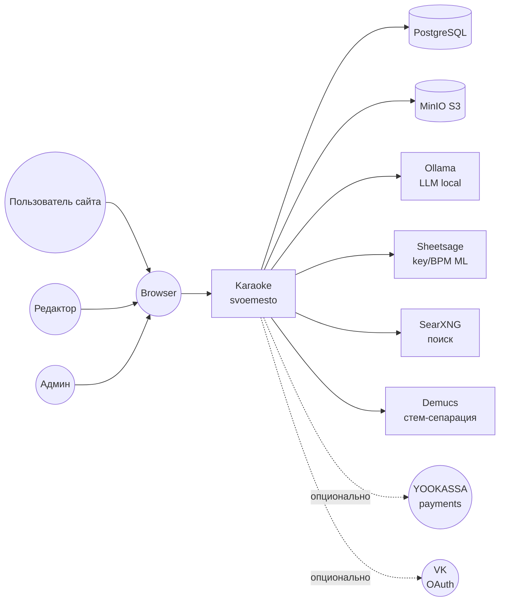

# C4 Level 1: System Context

> Karaoke (svoemesto) как чёрный ящик + внешние пользователи/системы.

## Что показывает

Эта диаграмма показывает, **кто пользуется Karaoke** и **с какими внешними
системами он взаимодействует**. Karaoke сам по себе — чёрный ящик; внутренние
детали (контейнеры, компоненты) — на L2/L3.

## Диаграмма (Mermaid)

## Внешние системы / пользователи

### Пользователь сайта
- **Тип**: пользователь (читатель)
- **Назначение**: слушать/смотреть караоке-видео
- **Взаимодействие**: браузер → публичный SPA → karaoke-web API

### Редактор
- **Тип**: пользователь (специальная роль)
- **Назначение**: обрабатывать песни (маркеры, разметка)
- **Взаимодействие**: браузер → karaoke-public (`/song/{id}` → «Взять в работу») или `webvue3`

### Админ
- **Тип**: пользователь (admin)
- **Назначение**: управление каталогом, очередями, настройками
- **Взаимодействие**: `webvue3` (SPA без авторизации, `permitAll()`)

### PostgreSQL
- **Тип**: реляционная БД
- **Назначение**: все данные (песни, альбомы, пользователи, настройки, события)
- **Протокол**: JDBC, port 5432

### MinIO
- **Тип**: S3-compatible объектное хранилище
- **Назначение**: медиа (аудио, видео, изображения)
- **Протокол**: S3 API, port 9000

### Ollama
- **Тип**: локальная LLM (Mistral, Llama, ...)
- **Назначение**: AI-поиск текстов песен, генерация summaries
- **Протокол**: HTTP (localhost:11434)

### Sheetsage
- **Тип**: локальная ML-модель
- **Назначение**: распознавание key / BPM / chords
- **Протокол**: HTTP (admin-машина)

### SearXNG
- **Тип**: локальный мета-поисковик
- **Назначение**: поиск текстов песен (когда LLM не справляется)
- **Протокол**: HTTP (admin-машина)

### Demucs
- **Тип**: локальная ML-модель (Facebook Research)
- **Назначение**: стем-сепарация (vocals / accompaniment / drums / bass / other)
- **Протокол**: Python subprocess через Docker

### YOOKASSA
- **Тип**: внешний платёжный шлюз (опционально, для подписок)
- **Назначение**: приём платежей за premium
- **Протокол**: HTTPS REST API

### VK
- **Тип**: внешний OAuth-провайдер (опционально)
- **Назначение**: альтернативная авторизация
- **Протокол**: OAuth 2.0

## Связи

- **Browser → Karaoke**: HTTPS, REST API (Spring Boot) + SSE для change notifications.
- **Karaoke → Postgres**: JDBC (raw, не JPA/Hibernate).
- **Karaoke → MinIO**: S3 API (через aws-sdk-java).
- **Karaoke → Ollama / Sheetsage / SearXNG**: HTTP (localhost на admin-машине).
- **Karaoke → Demucs**: `docker run` через `ProcessBuilder`.
- **Karaoke → YOOKASSA / VK**: HTTPS (опционально).

## Связанные LiveDocs

- Architecture: [L2-containers.md](L2-containers.md) — drill-down в контейнеры Karaoke.
- Domain: [catalog.md](../domain/catalog.md) | [publishing.md](../domain/publishing.md)

## История

- Создан: 2026-08-14
- Последнее обновление: 2026-08-14