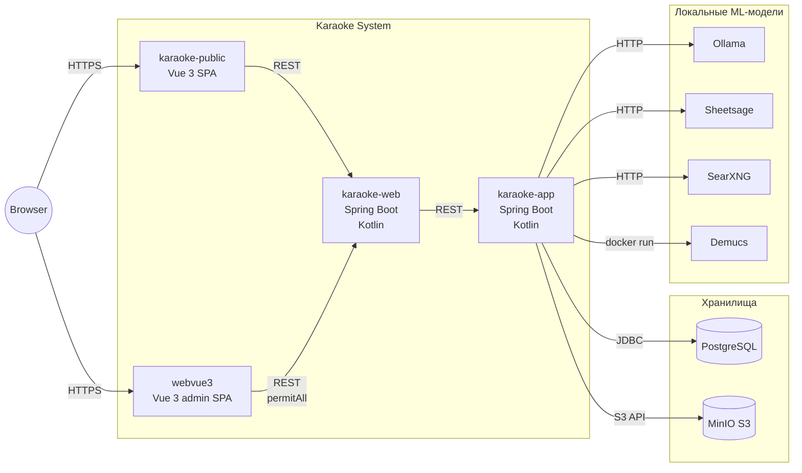

# C4 Level 2: Containers

> Приложения и хранилища внутри Karaoke.

## Что показывает

Drill-down уровня 1: какие **приложения** работают внутри Karaoke и как они
общаются друг с другом, какие **хранилища** используют.

## Диаграмма (Mermaid)

## Контейнеры

### karaoke-web
- **Назначение**: публичный API + legacy Thymeleaf-страницы (главная, листинг)
- **Технология**: Kotlin 1.x, Spring Boot 2.x/3.x, JDK 17, Thymeleaf
- **Ответственность**: HTTP-эндпоинты для публичного сайта, тонкий слой над `karaoke-app`
- **Разворачивается**: прод-сервер
- **Образ**: `eclipse-temurin:22-jre-jammy`
- **Использует**: `karaoke-app` (in-process или через shared jar)

### karaoke-app
- **Назначение**: ядро — модели, MLT-генератор, async-очередь, LLM-интеграция
- **Технология**: Kotlin 1.x, Spring Boot 2.x/3.x, JDK 17
- **Ответственность**: бизнес-логика, MLT, ProcessBuilder для ffmpeg/Demucs/Sheetsage, SSE
- **Разворачивается**: **ТОЛЬКО** на admin-машине (НЕ на проде)
- **Образ**: `eclipse-temurin:22-jre-jammy` + Docker CE внутри (намеренно)
- **Использует**: Postgres (JDBC), MinIO (S3), Ollama, Sheetsage, SearXNG, Demucs

### karaoke-public
- **Назначение**: публичный SPA — каталог, плеер, Закрома
- **Технология**: Vue 3 + Vite + Bootstrap 5
- **Ответственность**: classic/modern дизайн (выбор в `localStorage`), Vuex store
- **Разворачивается**: прод-сервер (статика за nginx)
- **Связь**: REST API к `karaoke-web`

### webvue3
- **Назначение**: админский SPA — управление каталогом, очередями, настройками
- **Технология**: Vue 3 + Vite + Bootstrap-vue-next + Vuex
- **Ответственность**: админка без авторизации (`permitAll()`), фильтры через `webvue_prop`
- **Разворачивается**: admin-машина
- **Связь**: REST API к `karaoke-web`

## Хранилища

### PostgreSQL
- **Тип**: реляционная БД
- **Версия**: 16
- **Назначение**: все данные (песни, альбомы, пользователи, настройки, события)
- **Доступ**: только через сырой JDBC (`KaraokeConnection`), **НЕ через JPA/Hibernate**
- **Сравнение LOCAL↔SERVER**: через `recordhash` (md5) + `associateBy { it.id }` (O(n))

### MinIO
- **Тип**: S3-compatible объектное хранилище
- **Назначение**: медиа (аудио, видео, изображения)
- **Bucket**: `karaoke`, `karaoke-public`, ...
- **Доступ**: через `aws-sdk-java` (S3 API)

## Локальные ML-модели (admin-машина)

| Модель | Назначение | Протокол |
|--------|-----------|----------|
| Ollama | LLM (Mistral, Llama) | HTTP localhost:11434 |
| Sheetsage | key / BPM / chords | HTTP |
| SearXNG | мета-поисковик | HTTP |
| Demucs | стем-сепарация | Python subprocess через Docker |

## Связи

- **karaoke-public → karaoke-web**: HTTPS REST.
- **webvue3 → karaoke-web**: HTTPS REST (`permitAll()`, без auth).
- **karaoke-web → karaoke-app**: in-process или REST (если отдельный процесс).
- **karaoke-app → Postgres**: JDBC.
- **karaoke-app → MinIO**: S3 API.
- **karaoke-app → Ollama / Sheetsage / SearXNG**: HTTP localhost.
- **karaoke-app → Demucs**: `docker run` через ProcessBuilder.

## Связанные LiveDocs

- Architecture: [L1-system-context.md](L1-system-context.md) — drill-up.
- Architecture: [L3-components.md](L3-components.md) — drill-down в karaoke-app.

## История

- Создан: 2026-08-14
- Последнее обновление: 2026-08-14