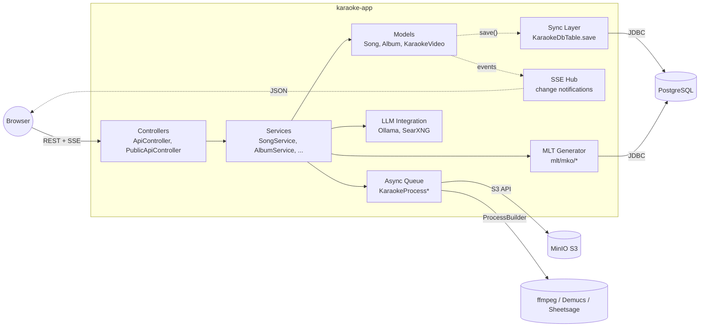

# C4 Level 3: Components (karaoke-app)

> Компоненты внутри karaoke-app.

## Что показывает

Drill-down уровня 2: какие крупные **модули** внутри `karaoke-app` и как они
общаются друг с другом.

## Диаграмма (Mermaid)

## Компоненты

### Controllers (слой контроллеров)
- **Назначение**: HTTP-эндпоинты (REST API + Thymeleaf)
- **Код**: `karaoke-app/src/main/kotlin/com/svoemesto/karaokeapp/controller/`
- **Главные классы**:
  - `ApiController.kt` — основной API (песни, альбомы, авторы, ...).
  - `PublicApiController.kt` — публичный API (stats, share-links, songeditor).
  - `MainController.kt` — Thymeleaf legacy (`/`).
- **Зависимости**: Services (через Spring DI)

### Services (слой бизнес-логики)
- **Назначение**: бизнес-логика, координация между моделями и инфраструктурой
- **Код**: `karaoke-app/src/main/kotlin/com/svoemesto/karaokeapp/service/`
- **Примеры**: `SongService`, `AlbumService`, `AuthorService`, `RenderMp4Service`
- **Зависимости**: Models, MLT, Queue, LLM, SSE

### Models (доменные модели)
- **Назначение**: доменные сущности с recordhash-diff для sync
- **Код**: `karaoke-app/src/main/kotlin/com/svoemesto/karaokeapp/model/`
- **Базовый класс**: `KaraokeDbTable` (интерфейс всех сущностей)
- **Сравнение**: через `associateBy { it.id }` (O(n), не O(n²))
- **Зависимости**: JDBC

### MLT Generator (генератор MLT)
- **Назначение**: генерация melt/MLT-проектов для караоке-видео
- **Код**: `karaoke-app/src/main/kotlin/com/svoemesto/karaokeapp/mlt/`
- **Объекты**: `mlt/mko/*` — по одному объекту на визуальный слой
- **Параметры**: ~150 настраиваемых в `KaraokeProperties.kt`
- **Зависимости**: Models (читает метаданные песни), Postgres (сохраняет MLTProject)

### Async Queue (асинхронная очередь)
- **Назначение**: длительные операции (ffmpeg, MLT, Demucs, Sheetsage, MinIO upload)
- **Код**: `karaoke-app/src/main/kotlin/com/svoemesto/karaokeapp/KaraokeProcess*.kt`
- **Паттерн**: OS-подпроцесс через `ProcessBuilder` + парсинг stdout
- **Важно**: `redirectErrorStream(true)` ВСЕГДА (иначе stderr буфер блокирует)
- **Lanes**: HEAVY_RENDER (0), LIGHT_BACKGROUND (-1), REMOTE_STORE_UPLOAD (-2), STEM_JOBS
- **Зависимости**: MinIO, ffmpeg, MLT, Demucs, Sheetsage

### LLM Integration
- **Назначение**: AI-поиск текстов песен, генерация summaries
- **Код**: `karaoke-app/src/main/kotlin/com/svoemesto/karaokeapp/llm/`
- **Провайдеры**: Ollama (LLM), SearXNG (мета-поиск)
- **Паттерн**: локальные модели, не SaaS (см. Constitution Principle I)

### SSE Hub (change notifications)
- **Назначение**: уведомление UI об изменениях в данных
- **Код**: `karaoke-app/src/main/kotlin/com/svoemesto/karaokeapp/sse/`
- **Протокол**: HTTP/2 long-poll, JSON payload
- **Триггер**: `KaraokeDbTable.save()` публикует событие
- **Зависимости**: Models (event publisher), Browser (subscriber)

### Sync Layer (LOCAL ↔ SERVER sync)
- **Назначение**: двусторонняя синхронизация LOCAL и SERVER
- **Код**: `karaoke-app/src/main/kotlin/com/svoemesto/karaokeapp/sync/`
- **Паттерн**: `SyncRegistry.all` (явное добавление), recordhash-триггеры в SQL
- **Флаги**: 8 флагов `sync_<key>_<push|pull>_<insert|update|delete|move>_allowed`
- **Зависимости**: Models (через `KaraokeDbTable`)

## Связи

- **Controllers ↔ Services**: in-process (Spring DI).
- **Services ↔ Models**: in-process, через `recordhash`.
- **Services ↔ MLT**: вызов при сохранении Song (idStatus переходы).
- **Services ↔ Queue**: enqueue задач через `KaraokeProcess.submit()`.
- **Models ↔ Sync**: автоматический diff в `KaraokeDbTable.save()`.
- **Models ↔ SSE**: события публикуются при save().
- **SSE ↔ Browser**: HTTP long-poll.

## Связанные LiveDocs

- Architecture: [L2-containers.md](L2-containers.md) — drill-up.
- Domain: [catalog.md](../domain/catalog.md) | [processing.md](../domain/processing.md) | [identity.md](../domain/identity.md)
- Architecture: [data-sync.md](data-sync.md) (drill-down по Sync Layer)
- Architecture: [queue-lanes.md](queue-lanes.md) (drill-down по Async Queue)

## История

- Создан: 2026-08-14
- Последнее обновление: 2026-08-14