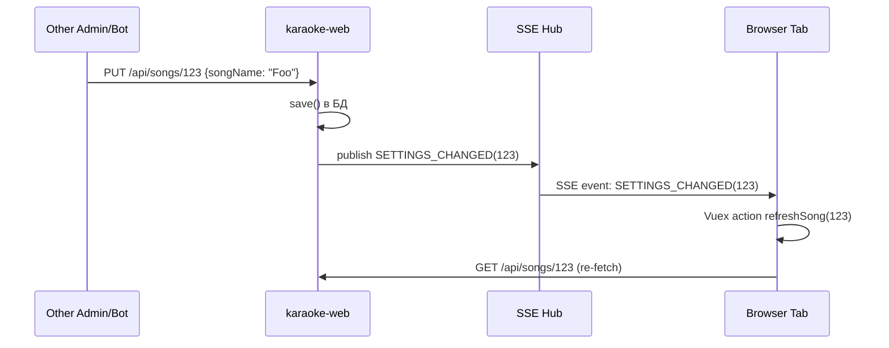

# Cache-Invalidation Patterns

> Кросс-cut паттерн: как webvue3 и других клиентов держит
> server-side кэшированное состояние в актуальном виде.

## Что показывает

В проекте есть несколько уровней кэша (Vuex в браузере, server-side
через `setWebvueProp/getWebvueProp`, `tbl_events` для событий посещений).
Это конвенция их использования.

**Когда читать**:
- Добавляете новую админ-таблицу.
- Меняете состояние Vuex через мутацию (нужно решить — должно ли оно
  переживать F5?).

## Основной паттерн: `setWebvueProp` / `getWebvueProp`

Сервер-сайд key/value кэш для UI-свойств, которые должны переживать
F5 и быть общими для всех вкладок админа (например, последний просмотренный
автор, последний фильтр).

```kotlin
// karaoke-web/.../WebvuePropService.kt
@Service
class WebvuePropService {
    fun set(key: String, value: String) {
        // UPDATE tbl_webvue_prop SET value=? WHERE key=?
    }
    fun get(key: String): String? { ... }
    fun getInt(key: String): Int? = get(key)?.toIntOrNull()
}
```

```sql
CREATE TABLE tbl_webvue_prop (
    key TEXT PRIMARY KEY,
    value TEXT NOT NULL,
    updated_at TIMESTAMP DEFAULT now()
);
```

### Применение

```javascript
// webvue3/src/services/webvuePropApi.js
const perPage = await webvuePropApi.getInt('songs.table.perPage', 20)
await webvuePropApi.set('songs.table.perPage', 50)
```

Это ВОЗМОЖНО разные уровни кэша:
1. **In-memory** (Vuex) — на время сессии, до перезагрузки F5.
2. **sessionStorage** — на время вкладки браузера.
3. **localStorage** — постоянно для этого браузера.
4. **`tbl_webvue_prop`** на сервере — общее для всех вкладок/машин админа.

## Паттерн: «строгая персистентность» в admin-таблицах

Стандартный паттерн (см. [AGENTS.md](../../AGENTS.md) Q&A и
[webvue3-patterns.md](webvue3-patterns.md)):

```javascript
// SongsTable.vue
data() {
    return {
        currentPage: this.$store.getters.getSongsTableCurrentPage || 1,
        perPage: this.$store.getters.getSongsTablePerPage || 25,
    }
},
watch: {
    currentPage(newPage) {
        this.$store.commit('setSongsTableCurrentPage', newPage)
    },
    perPage(newPerPage) {
        this.$store.commit('setSongsTablePerPage', newPerPage)
        this.$store.dispatch('persistSongsTablePerPage', newPerPage)  // → server
    },
},
beforeDestroy() {
    // cleanup не нужен — Vuex живёт в сессии
},
```

### Применимо в:

- `SiteUsersTable` (`perPage`, `currentPage`)
- `SitePlaylistsTable`
- `ProcessesTable`
- `SongsTable`
- `AlbumsTable`
- и т.п. (стандарт для всех admin-таблиц).

## Паттерн: «Live-обновление через SSE»

Если данные могут измениться на **сервере** (другой админ, bot, sync),
админка должна получать уведомление. Два пути:

### A. SSE (real-time, основной)



### B. Polling (fallback, медленнее)

```javascript
// каждые 20 сек
setInterval(async () => {
    await this.$store.dispatch('refreshIfNeeded')
}, 20000)
```

(например, [176-authors-new-albums-badge.md](../features/176-authors-new-albums-badge.md)
использует polling для бейджа автора — потому что состояние зависит от
других админов).

## Cache Invalidation Triggers

| Trigger | Действие | Где |
|---------|----------|-----|
| `save()` KaraokeDbTable | `publish SETTINGS_CHANGED(songId)` | `KaraokeDbTable.kt` |
| `sync` LOCAL→SERVER | `publish SETTINGS_CHANGED(songId)` при изменениях | `SyncRegistry.kt` |
| `bot` обновил `tbl_news` | `publish PROCESS_LIST_CHANGED` | `VkPublishService.kt` |
| Админ редактирует песню | `publish` после save | `SongController.kt` |
| Plan-scheduler | `publish PROCESS_*` | `Scheduler*.kt` |

## Когда НЕ использовать кэширование

- ❌ **Данные, нужные для security/permissions** (например, `isEditor`) —
  читать всегда свежими.
- ❌ **Данные с TTL > 1 часа** (например, `StatBySong`) — лучше пересчитывать
  периодически, а не кэшировать.
- ❌ **Большие объекты в localStorage** (>1 MB) — лимит ~5 MB на домен.

## Когда использовать

- ✅ Фильтры и пагинация — пользователь возвращается на ту же страницу
  после switch-меню.
- ✅ Персистентные персональные настройки (период автообновления, выбранный
  lane).
- ✅ Live-обновление (через SSE) для важных сущностей.

## Связанные LiveDocs

- [L2-containers.md](L2-containers.md) — где Vuex state lives.
- [webvue3-patterns.md](webvue3-patterns.md) — стандартный паттерн
  персистентности страницы.
- [features/171-admin-subscriptions-history.md](../features/171-admin-subscriptions-history.md),
  [176-authors-new-albums-badge.md](../features/176-authors-new-albums-badge.md) —
  примеры.

## Код

- `karaoke-web/.../WebvuePropService.kt` — server-side кэш.
- `karaoke-app/.../sse/Sns.kt` — SSE producer.
- `webvue3/src/store/modules/Modules/store.js` — Vuex стандарт.

## История

- Создан: 2026-08-14
- Последнее обновление: 2026-08-14