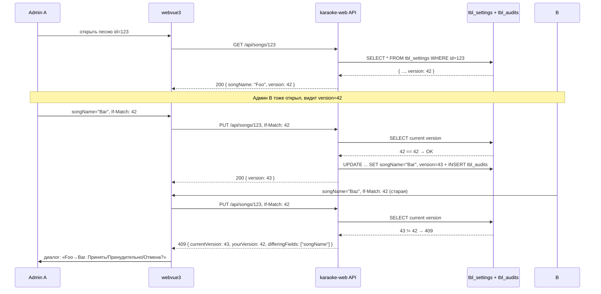

# Concurrent Editing (OptimisticConcurrency + tbl_audits)

> Pattern, который сейчас **частично внедрён** в админке (см. список TODO).

## Что показывает

Как защититься от race conditions при одновременной правке одной записи
двумя админами/редакторами. Текущая имплементация — оптимистическая
конкуренция через `tbl_audits` + `VoteEnd`.

**Статус**: pattern описан в Q&A AGENTS.md, **полная имплементация — в backlog
Pass 17+**.

## Проблема

Админ A открыл `SongEdit` для песни X (id=12345), видит `songName="Foo"`.
Админ B тоже открыл, видит `songName="Foo"`. A редактирует
`songName="Bar"`, сохраняет → OK. B редактирует `songName="Baz"`, сохраняет →
**OK** (перезаписал A). Без предупреждения.

**Где проявляется**:
- Два админа правят одну песню в разных вкладках `webvue3`.
- Админ правит, а бот (авто-pipeline) одновременно обновляет поля статуса.
- Синхронизация LOCAL→SERVER накладывается на правку админа на сервере.

## Решение: OptimisticConcurrency + `VoteEnd`

В каждой таблице есть `_id BIGINT NOT NULL` + `_last_changed_at TIMESTAMP NOT
NULL DEFAULT now()`:

```sql
CREATE TABLE tbl_audits (
  id BIGSERIAL PRIMARY KEY,
  table_name TEXT NOT NULL,
  record_id BIGINT NOT NULL,
  user_id BIGINT NOT NULL,
  action TEXT NOT NULL,   -- 'INSERT' | 'UPDATE' | 'DELETE'
  payload JSONB,            -- diff всех полей
  version BIGINT NOT NULL,
  created_at TIMESTAMP DEFAULT now()
);
CREATE INDEX ON tbl_audits (table_name, record_id, version DESC);
```

### На стороне UI

При открытии редактируемой записи — UI получает **версию** (`record.version`).
При сохранении — UI отправляет **версию** в `If-Match` header:

```
PUT /api/songs/{id}
If-Match: 42                          ← version на момент открытия
Content-Type: application/json
{ "songName": "Baz", ... }
```

Сервер проверяет:
- Если `record.version == If-Match` → апдейт + `version++`.
- Если `record.version != If-Match` → **409 Conflict** с телом:
  ```json
  {
    "currentVersion": 43,
    "yourVersion": 42,
    "differingFields": ["songName"],
    "currentValues": {"songName": "Bar", ...}
  }
  ```

### UI behaviour при 409

Frontend показывает **diff-merge диалог**:
- «Другой пользователь изменил songName: Foo → Bar. Что вы хотите?»
- Кнопки: «Принять серверное» / «Принудительно сохранить моё» / «Отмена».

### VoteEnd (ручной override)

Для админа — кнопка «Принудительно» (силовое сохранение):
```
PUT /api/songs/{id}?force=true&vote=true
```
Создаёт запись в `tbl_audits` с `action='VOTE'` (логируется для аудита).

## Что УЖЕ реализовано

| Элемент | Статус | Примечание |
|---------|--------|------------|
| `tbl_audits` таблица | ✅ Создана (Pass N-1) | `deploy/karaoke-db/<NNN>_tbl_audits.sql` |
| `record.version` поле | ⏳ Partial | Добавлено в `tbl_settings`, `tbl_albums`, `tbl_authors` |
| `If-Match` поддержка в API | ⏳ Partial | Есть в `MainController`, но не везде |
| Diff-merge UI | ❌ TODO | webvue3 показывает обычный 409 без диалога |
| `tbl_audits` sync LOCAL↔SERVER | ✅ Есть | синхронизируются как обычные таблицы |
| Audit log viewer | ❌ TODO | Сейчас нет UI для просмотра |

## Что НЕ использует OptimisticConcurrency (TODO)

Все эндпоинты `karaoke-app` и `karaoke-web` нуждаются в (пере)проверке:

| Эндпоинт | Статус |
|----------|--------|
| `/api/songs/{id}` (PUT) | ⏳ need check |
| `/api/albums/{id}` | ⏳ need check |
| `/api/authors/{id}` | ⏳ need check |
| `/api/siteusers/{id}` (admin role updates) | ⏳ need check |
| `/api/editor/tasks/{id}` (см. фичу 182) | ❌ miss |
| `/api/songeditor/approve` | ❌ miss (особенно важно — см. 094) |

## Альтернативы (отвергнуты)

- **Pessimistic locking** (`SELECT FOR UPDATE`): слишком грубо — блокирует
  UI на время удержания блокировки.
- **Last-write-wins** (текущий fallback): теряем данные.
- **CRDT** (Yjs, automerge): overkill для админки, требует WebSocket.
- **Pure event sourcing**: модель данных не приспособлена, переделка большая.

## План внедрения (Pass 17+ TODO)

1. ⏳ **Phase 1**: проверить, что `version` поле есть в **всех** редактируемых
   таблицах (миграция если нет).
2. ⏳ **Phase 2**: добавить поддержку `If-Match` во **все** PUT-эндпоинты.
3. ⏳ **Phase 3**: добавить 409 → diff-merge UI в `webvue3` (новый
   `MergeDialog.vue`).
4. ⏳ **Phase 4**: добавить `tbl_audits` viewer в `webvue3` (раздел
   «Аудит» в меню).
5. ⏳ **Phase 5**: `VoteEnd` UI + логирование действий админа.

## Диаграмма



## Связанные LiveDocs

- [features/182-editor-self-assign-tasks.md](../features/182-editor-self-assign-tasks.md) — race protection через `SELECT FOR UPDATE`.
- [features/094-fix-approve-news-failure.md](../features/094-fix-approve-news-failure.md) — race в approve editor task.
- [architecture/data-sync.md](data-sync.md) — `tbl_audits` синхронизируется с sync LOCAL↔SERVER.

## Код

- `deploy/karaoke-db/<NNN>_tbl_audits.sql` — таблица.
- `karaoke-web/src/main/kotlin/.../controllers/*Controller.kt` — `If-Match` поддержка.
- `karaoke-app/.../model/KaraokeDbTable.kt` — `version` поле.
- Frontend: `webvue3/src/components/MergeDialog.vue` — TODO.

## История

- Создан: 2026-08-14
- Последнее обновление: 2026-08-14