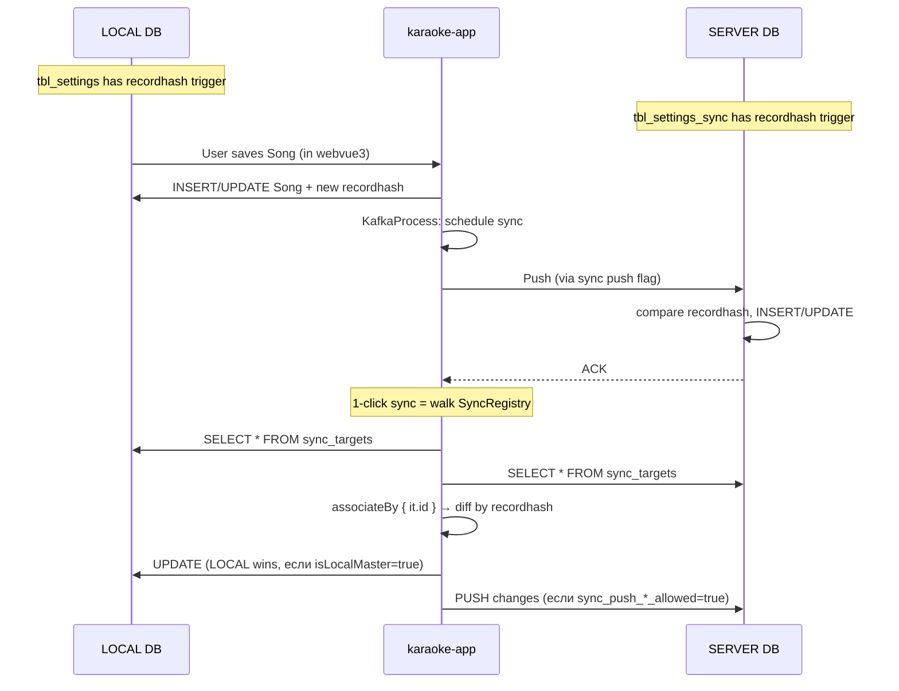

# Тема: LOCAL ↔ SERVER синхронизация

> Drill-down по Sync Layer из [L3-components.md](L3-components.md).

## Что показывает

Как работает двусторонняя синхронизация данных между **LOCAL** (admin-машина)
и **SERVER** (прод) в Karaoke. Это критичная подсистема — без неё невозможна
работа в офлайн-режиме на admin-машине с последующей выкаткой на прод.

## Диаграмма (Mermaid)



## Архитектура Sync

### SyncRegistry
- **Файл**: `karaoke-app/src/main/kotlin/com/svoemesto/karaokeapp/sync/SyncTarget.kt`
- **Назначение**: явный список сущностей, участвующих в sync (`SyncRegistry.all`).
- **Главное правило**: наличие `recordhash`-триггера в SQL **НЕ** означает
  участие в sync. Нужно явно добавить в `SyncRegistry`.

### Флаги sync (8 штук на сущность)
- `sync_<key>_push_insert_allowed`
- `sync_<key>_push_update_allowed`
- `sync_<key>_push_delete_allowed`
- `sync_<key>_push_move_allowed`
- `sync_<key>_pull_insert_allowed`
- `sync_<key>_pull_update_allowed`
- `sync_<key>_pull_delete_allowed`
- `sync_<key>_pull_move_allowed`

Все 8 флагов задаются в `KaraokeProperties.kt` (через админку).

### recordhash-триггер
- **Что**: md5 от канонизированной строки таблицы.
- **Где**: SQL-миграция (`deploy/karaoke-db/<NNN>_<table>.sql`).
- **Зачем**: O(n) сравнение рекордов между двумя БД через `associateBy { it.id }`.
- **Важно**: при изменении колонок таблицы ОБЯЗАТЕЛЬНО пересоздаётся триггер
  для затронутых таблиц (LOCAL и PROD) — иначе md5 разойдётся и sync сломается.

### KaraokeDbTable.save()
- **Файл**: `karaoke-app/src/main/kotlin/com/svoemesto/karaokeapp/model/KaraokeDbTable.kt`
- **Назначение**: единая точка сохранения для всех сущностей.
- **Логика**: save → diff с прежним состоянием → если есть изменения →
  вычислить новый recordhash → опубликовать SSE event.

## Паттерны

### Производительность: O(n) vs O(n²)
```kotlin
// ✅ ПРАВИЛЬНО (O(n))
val localById = localList.associateBy { it.id }
val serverById = serverList.associateBy { it.id }
localById.keys.intersect(serverById.keys).forEach { id ->
  if (localById[id]!!.recordhash != serverById[id]!!.recordhash) {
    pushToServer(localById[id]!!)
  }
}

// ❌ НЕПРАВИЛЬНО (O(n²) — 3+ минуты на 18k записей!)
localList.forEach { local ->
  serverList.none { it.id == local.id && it.recordhash == local.recordhash }
}
```

### Загрузка для diff: пакетно, не по одной
```kotlin
// ✅ ПРАВИЛЬНО — 1 запрос
jdbcTemplate.queryForObject(
  "SELECT * FROM tbl_song WHERE id IN ($idsCsv)",
  rowMapper
)

// ❌ НЕПРАВИЛЬНО — N+1 запросов
ids.forEach { id ->
  jdbcTemplate.queryForObject("SELECT * FROM tbl_song WHERE id = ?", ...)
}
```

## Ловушки

- **`recordhash`-триггер пересоздаётся при изменении колонок**. Если забыть —
  md5 разойдётся, sync сломается без видимой ошибки.
- **`SyncRegistry.all` ≠ триггеры в SQL**. Триггер есть в обеих БД,
  но в sync сущность попадает только если явно добавлена.
- **Снятие/установка флагов в `KaraokeProperties`** — только через админку,
  не прямой правкой файла.

## Связанные LiveDocs

- Domain: [catalog.md](../domain/catalog.md) (Song как самая большая синхронизируемая сущность)
- Architecture: [L3-components.md](L3-components.md) (где живёт Sync Layer)

## Код

- Sync: `karaoke-app/src/main/kotlin/com/svoemesto/karaokeapp/sync/SyncRegistry.kt`, `KaraokeDbTable.kt`
- Флаги: `karaoke-app/src/main/kotlin/com/svoemesto/karaokeapp/KaraokeProperties.kt`
- SQL: `deploy/karaoke-db/<NNN>_tbl_<table>_recordhash.sql`
- Тест: ручной (`doUpdateRemoteSettingFromLocalDatabase` в админке)

## История

- Создан: 2026-08-14
- Последнее обновление: 2026-08-14