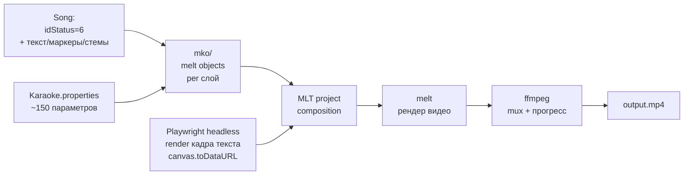

# MLT Pipeline (drill-down для L3)

> Drill-down для [L3-components.md](L3-components.md) и
> [decisions/0002-mlt-instead-of-ffmpeg.md](decisions/0002-mlt-instead-of-ffmpeg.md).

## Что показывает

Как именно работает генерация караоке-видео через MLT/melt + Playwright + ffmpeg.
Большая уникальная подсистема проекта.

**Когда читать**:
- Редактируете `melt/mko/*.kt`.
- Добавляете новую версию видео (например, `LYRICS_4K`).
- Тюните ~150 параметров в `Karaoke.properties`.
- Жалуетесь на медленный рендер.

## Диаграмма



## Три версии финального видео

| Версия | Размер | FPS | Audio mix | Назначение | Файл |
|--------|--------|-----|-----------|------------|------|
| **LYRICS** | 1920×1080 | 60 | acc(1.0) + voc(1.0) | Полный показ с вокалом | `lyrics.mp4` |
| **KARAOKE** | 1920×1080 | 60 | acc(1.0) + voc(0.0) | Без вокала | `karaoke.mp4` |
| **DEMO** | 1280×720 | 30 | acc(1.0) + voc(0.0), фрагмент 30с | Превью для шеринга | `demo.mp4` |

Каждая версия — отдельный вызов `melt -consumer avformat:<file> -profile <p>`.

## mko/ — объекты по слоям

Слой видео = один `mko` объект (в Kotlin):

```kotlin
// mlt/mko/BackgroundMko.kt
class BackgroundMko(
    private val imagePath: String,  // обложка альбома
    private val opacity: Float = 1.0f,
    private val width: Int = 1920,
    private val height: Int = 1080
) : Mko {
    override fun asMltProp(): String =
        """image=$imagePath opacity=$opacity in=$width out=$height"""
}
```

Слои:
- `BackgroundMko` — фон (обложка альбома или видеофон).
- `VideoBackgroundMko` — опциональный анимированный фон.
- `TextMko` — текст с маркерами (см. ниже).
- `AudioMko` — аудиослой (acc / voc / bass / drums).
- `EffectsMko` — fade in/out, blur, blend.

## TextMko + Playwright (drill-down)

Текстовый слой — самый сложный. MLT не умеет красиво рендерить текст с
прозрачностью + все CSS-эффекты. Используем Playwright:

```kotlin
// mlt/TextMko.kt
class TextMko(private val lyrics: Lyrics, private val timecode: Timecode) : Mko {
    override fun asMltProp(): String {
        // Шаг 1: Playwright headless рендерит HTML+CSS в PNG/JPEG
        val png = playwright.renderFrame(
            html = templates.lyricsHtml(lyrics, timecode),
            format = "image/jpeg",
            quality = 0.95  // JPEG quality 95 = в 3 раза быстрее PNG без потери
        )
        // Шаг 2: сохранить в MinIO / локальный кэш
        val path = cache.put(png, "text-${songId}-${timecode}")
        // Шаг 3: MLT-property
        return """image=$path start=${timecode.startMs} end=${timecode.endMs}"""
    }
}
```

### «JPEG quality 95» trick (заметка)

```
PNG quality 100: ~280 KB на кадр, 4 sec на frame
JPEG quality 95: ~90 KB на кадр, 1.5 sec на frame (визуально неотличимо)
```

**Измерил пользователь** (на пре-релизе Pass 14+). Реальный выигрыш:
3-4× быстрее без видимой потери качества.

## Свойства KaraokeProperties (~150 настраиваемых)

`karaoke-app/src/main/kotlin/com/svoemesto/karaokeapp/KaraokeProperties.kt`
хранит параметры в файле `/sm-karaoke/system/Karaoke.properties` (на
admin-машине). Редактируются через Properties UI/API без перекомпиляции.

**Группы свойств**:
- `MLT_FONT_FAMILY`, `MLT_FONT_SIZE`, `MLT_FONT_COLOR` — текст.
- `MLT_TEXT_X`, `MLT_TEXT_Y` — позиция.
- `MLT_FADE_IN_MS`, `MLT_FADE_OUT_MS` — fade.
- `RENDER_DEMO_SECONDS=30`, `RENDER_LYRICS_FPS=60` — версии.
- `PLAYWRIGHT_HEADLESS=true`, `PLAYWRIGHT_QUALITY=0.95` — рендер.
- и т.п. (~150 в сумме).

Метод `KaraokeProperties.get(key)` кеширует; `set(key, value)` пишет в файл.

## Progress parsing

Прогресс читается через **stdout** текущего процесса (см. queue-lanes.md):

| Tool | Regex | Пример |
|------|-------|--------|
| **ffmpeg** | `time=HH:MM:SS.ms` | `time=00:01:23.45` |
| **melt** | `NN%` | `50%` |
| **Sheetsage** | `NN%\|` | `45%\|` |
| **Demucs** | `NN%` | `30%` |

В `KaraokeProcess*:XX` парсится в `ProgressInfo(currentPercent, etaSeconds)`
→ пересылается через SSE в `webvue3` для UI.

### `redirectErrorStream(true)` ВСЕГДА

```kotlin
// ✅ ПРАВИЛЬНО
val pb = ProcessBuilder(cmd).redirectErrorStream(true)

// ❌ ЗАПРЕЩЕНО (stderr буфер ~64KB переполняется → блокировка)
val pb = ProcessBuilder(cmd).redirectErrorStream(false)
```

См. Constitution § IV и `decisions/0002-...md`.

## CPU limit

Три слоя CPU-лимитов:
1. **Docker `--cpus`** в `docker-compose.yml` (per-container).
2. **`MLT_CPU_LIMIT`** в `KaraokeProperties`.
3. **`docker update`** динамический.

`MLT_CPU_LIMIT` важен потому что без него 4 параллельных рендера
займут все ядра → UI висит.

## Код

- `karaoke-app/src/main/kotlin/com/svoemesto/karaokeapp/mlt/` — mko-классы.
- `karaoke-app/src/main/kotlin/com/svoemesto/karaokeapp/mlt/TextMko.kt` — текст через Playwright.
- `karaoke-app/src/main/kotlin/com/svoemesto/karaokeapp/mlt/MltProject.kt` — composition.
- `karaoke-app/src/main/kotlin/com/svoemesto/karaokeapp/KaraokeProperties.kt` — ~150 параметров.
- `karaoke-app/src/main/kotlin/com/svoemesto/karaokeapp/mlt/PlaywrightRunner.kt` — headless рендер.
- `karaoke-app/src/main/kotlin/com/svoemesto/karaokeapp/mlt/MeltRunner.kt` — вызов `melt`.

## Когда что-то идёт не так

| Симптом | Вероятная причина | Где смотреть |
|---------|-------------------|---------------|
| Пустой текст на видео | Playwright повис / `canvas.toDataURL` упал | `/tmp/playwright.log`, `mlt/PlaywrightRunner.kt` |
| Прогресс не двигается | ffmpeg/melt завис на stdin | `KaraokeProcess*.doStart()` — парсинг |
| Текст обрезанный | Неверный `MLT_TEXT_X/Y` | `KaraokeProperties.kt` |
| Аудио без тишины в начале/конце | Неправильные `FADE_IN_MS/FADE_OUT_MS` | см. выше |
| Падение melt с exit 1 | Несовместимая версия MLT | `/usr/bin/melt --version` |

## Связанные LiveDocs

- [ADR-0002](decisions/0002-mlt-instead-of-ffmpeg.md) — почему MLT.
- [L3-components.md](L3-components.md) — где живёт MLT Generator.
- [queue-lanes.md](queue-lanes.md) — HEAVY_RENDER lane для тяжёлого рендера.
- [domain/processing.md](../domain/processing.md) — bounded context `processing`.

## История

- Создан: 2026-08-14
- Последнее обновление: 2026-08-14