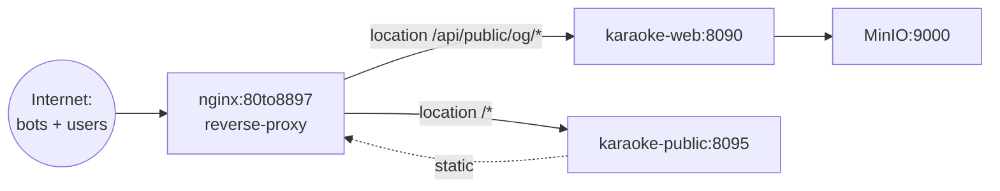

# nginx — конвенции и конфигурация для Karaoke

> Drill-down для [L1-system-context.md](L1-system-context.md) и
> [docker-conventions.md](docker-conventions.md) (см. там образы).

## Что показывает

Главный nginx на проде (`/etc/nginx/sites-enabled/80to8897`) —
reverse-proxy для `karaoke-web` (8090) и `karaoke-public` (клиент).
Особенности для Karaoke — User-Agent routing для OG-парсинга и
**отключение буферизации для NDJSON-стрима**.

**Образ**: `nginx:stable` (НЕ `nginx:alpine` — нет bash, нужен для
скриптов `compose`; см. [docker-conventions.md](docker-conventions.md)).

## Диаграмма



## Файл `80to8897`

Файл не симлинк, находится в `/etc/nginx/sites-enabled/80to8897`
на **прод-сервере**. Копируется вручную из `deploy/web-server-deploy/deploy/80to8897`
при `rsync` (см. `deploy/deploy_web.sh`).

**После rsync**:
```bash
ssh root@${PROD_HOST} "cp /root/Karaoke/deploy/80to8897 /etc/nginx/sites-enabled/80to8897 && nginx -t && systemctl reload nginx"
```

## Ключевые секции конфига

### 1. User-Agent routing → `/api/public/og/song`

Боты (vkShare, TelegramBot, Twitterbot, facebookexternalhit, LinkedInBot,
WhatsApp, Slackbot, ViberBot, SkypeUriPreview, Googlebot, bingbot, YandexBot,
YandexImages) — перенаправляются на SEO-HTML endpoint **вместо** SPA:

```nginx
location /song {
    if ($http_user_agent ~* "vkShare|TelegramBot|Twitterbot|facebookexternalhit|LinkedInBot|WhatsApp|Slackbot|ViberBot|SkypeUriPreview|Googlebot|bingbot|YandexBot|YandexImages") {
        proxy_pass http://karaoke-web/api/public/og/song;
        break;
    }
    try_files $uri /index.html;  # SPA
}
```

См. [180-og-seo-html.md](../../features/180-og-seo-html.md).

### 2. NDJSON-стрим — ОТКЛЮЧИТЬ буферизацию + gzip

**КРИТИЧНО** для [181-zakroma-author-load-progress.md](../../features/181-zakroma-author-load-progress.md):

```nginx
location /api/public/zakroma/stream {
    proxy_pass http://karaoke-web;
    proxy_buffering off;       # ВАЖНО: иначе буфер ~4KB → весь стрим
    gzip off;                  # ВАЖНО: gzip рвёт NDJSON (newline в середине gzip)
    proxy_cache off;           # кэш неприменим (chunked)
    proxy_read_timeout 300s;   # длинные стримы (>60s timeout nginx default)
}
```

Если не отключить — посетитель получит весь ответ разом после полной отдачи
бэка (или вовсе timeout 60s).

### 3. Статика `karaoke-public` — SPA

```nginx
location / {
    root /opt/karaoke-public;
    try_files $uri /index.html;  # SPA fallback
}
```

### 4. API проксирование → `karaoke-web`

```nginx
location /api/ {
    proxy_pass http://karaoke-web;
    proxy_set_header Host $host;
    proxy_set_header X-Real-IP $remote_addr;
    proxy_set_header X-Forwarded-For $proxy_add_x_forwarded_for;
    proxy_set_header X-Forwarded-Proto $scheme;
}
```

### 5. WebSocket / SSE для `karaoke-web`

```nginx
location /api/subscribe {
    proxy_pass http://karaoke-web;
    proxy_http_version 1.1;
    proxy_set_header Connection "";          # для HTTP/1.1 keep-alive
    proxy_buffering off;                    # не буферизовать SSE
    proxy_read_timeout 24h;                 # SSE длинные
}
```

## Что НЕЛЬЗЯ делать

- ❌ **Не** использовать `proxy_buffering on` для стримов (см. §2).
- ❌ **Не** включать `gzip on` для NDJSON (см. §2).
- ❌ **Не** делать `proxy_read_timeout 60s` для долгих endpoint'ов (см. §2, §5).
- ❌ **Не** использовать `nginx:alpine` (нет bash) — только `nginx:stable`.
- ❌ **Не** коммитить `/etc/nginx/sites-enabled/80to8897` напрямую (это
  runtime-файл, конфигурируется через `deploy/`).

## Что МОЖНО делать

- ✅ Использовать `try_files $uri /index.html` для SPA fallback.
- ✅ Использовать `$http_user_agent ~* "regex"` для routing ботов.
- ✅ Использовать `proxy_set_header X-Forwarded-*` для прокидки IP.
- ✅ Включать gzip для **HTML/JSON** (но **не** для NDJSON-стримов).
- ✅ Ставить `proxy_http_version 1.1` для SSE.

## Что настраивается через env-переменные

IP-адреса и хосты — **через env-переменные**, **НЕ** через хардкод (см. Constitution § VIII.5):

```nginx
# ❌ НЕПРАВИЛЬНО
proxy_pass http://188.119.64.111:8090;

# ✅ ПРАВИЛЬНО (через $prod_host)
set $prod_host "karaoke-web-container";  # docker-compose service name
proxy_pass http://$prod_host:8090;
```

В docker-compose-network `prod_host` может быть именем сервиса. В других
случаях — IP через env (`PROD_HOST=...`).

## Логи и мониторинг

- Логи nginx на проде: `/var/log/nginx/access.log` + `error.log`.
- Логи пересматриваются при инцидентах.
- Мониторинг: отдельный `RenderQueueStalledCheck` (см.
  [087-fix-shared-db-connection.md](../../features/087-fix-shared-db-connection.md))
  — не мониторит nginx, но реагирует на stalls очереди.

## Связанные LiveDocs

- [L1-system-context.md](L1-system-context.md) — где живёт nginx.
- [L2-containers.md](L2-containers.md) — куда nginx проксирует.
- [docker-conventions.md](docker-conventions.md) — образ `nginx:stable`.
- [180-og-seo-html.md](../../features/180-og-seo-html.md) — User-Agent routing.
- [181-zakroma-author-load-progress.md](../../features/181-zakroma-author-load-progress.md) — NDJSON
  (`proxy_buffering off`, `gzip off`).

## Код

- `deploy/web-server-deploy/deploy/80to8897` — основной конфиг.
- `deploy/deploy_web.sh` — deploy-скрипт с rsync.

## История

- Создан: 2026-08-14
- Последнее обновление: 2026-08-14