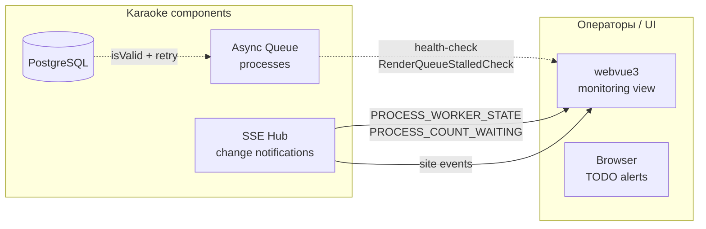

# Observability: мониторинг, логи, метрики

> Кросс-cut паттерн: как проект Karaoke наблюдаем за состоянием системы
> (и какие инструменты/соглашения используем).

## Что показывает

Какие observability-инструменты уже внедрены в проекте (и где их искать):
- **SSE** — change notifications (главный канал real-time update).
- **Heartbeat** через `RenderQueueStalledCheck` (восстановление воркера).
- **Self-healing** через `KaraokeConnection.isValid()` (см.
  [dual-db-access.md](dual-db-access.md)).
- **Кастомные метрики** для web-events, viral, share-link (Pass N+).

**Когда читать**:
- Ищете «куда смотреть, когда что-то лежит».
- Проектируете новый компонент и хотите знать, какие observability-соглашения применять.

## Диаграмма



## Главный канал real-time: SSE

SSE (Server-Sent Events) — основной механизм real-time update
`webvue3` ↔ `karaoke-web`.

**Эндпоинт**: `/api/subscribe?tabId=...` (long-poll).

**События** (см. также [queue-lanes.md](queue-lanes.md)):

| Event | Описание | Когда срабатывает |
|-------|----------|-------------------|
| `PROCESS_COUNT_WAITING` | Кол-во заданий в очереди | Только при реальном изменении числа (после [177-fix-process-count-waiting-spam](../../features/177-fix-process-count-waiting-spam.md)) |
| `PROCESS_WORKER_STATE` | `isWork` воркера (вкл/выкл) | При старте/остановке воркера |
| `PROCESS_LIST_CHANGED` | Список процессов (used в таблицах) | При изменении статуса процесса |
| `SETTINGS_CHANGED` | Изменение `tbl_settings` | При save() через `KaraokeDbTable` |
| `SITE_EVENT` | Событие посетителя | При каждом визите/событии (если включено) |
| `CHAT_NEW_MESSAGE` | Новое сообщение в чате | При поступлении от Telegram/Slack bot |

### Anti-pattern: спам одинаковых событий

До фикса [177](../../features/177-fix-process-count-waiting-spam.md) в SSE
летели десятки дублей `PROCESS_COUNT_WAITING` (countWaiting=0) в секунду.
Теперь — только при реальном изменении значения.

## RenderQueueStalledCheck (heartbeat)

Scheduled job (см. [087-fix-shared-db-connection.md](../../features/087-fix-shared-db-connection.md))
проверяет, что воркер очереди **не завис**:

```
@Scheduled(fixedRate = 60_000)
fun check() {
    val processes = jdbcTemplate.queryForObject(
        "SELECT count(*) FROM tbl_processes WHERE status = 'RUNNING' AND thread_id = ?",
        Long::class.java,
        HEAVY_RENDER  // например
    )
    if (processes == 0L && hasWaitingTasks()) {
        // Воркер не стартует задания → stall → restart
        restartQueueWorker("HEAVY_RENDER")
    }
}
```

**Recovery**: авто-restart воркера (не нужно ручное «one-click resume»).

## KaraokeConnection self-healing

(см. [dual-db-access.md](dual-db-access.md))

- `conn.isClosed` → пересоздать.
- `conn.isValid(2)` → пересоздать.
- `docker pause karaoke-db` на 30s → автоматическое восстановление.

## Метрики web-events (Pass N+)

Таблица `tbl_events` собирает события посетителей (для аналитики воронки
`visitor → premium`, см. [features/187-site-traffic-anomaly-investigation.md](../../features/187-site-traffic-anomaly-investigation.md)).

Поля:
- `eventType` — тип (visit/registration/premium_purchase/...)
- `visitor` — анонимный или авторизованный.
- `botScore` (0..1) — сегментация ботов (см. [180-og-seo-html.md](../../features/180-og-seo-html.md)).
- `createdAt`, `durationMs`, `firstChunkMs` — тайминги.

## Self-healing rules

| Условие | Действие | Где |
|---------|----------|-----|
| `conn.isClosed` | Пересоздать connection (ThreadLocal) | `KaraokeConnection.kt` |
| `conn.isValid(2) == false` | Пересоздать | то же |
| `countWaiting == 0` долгое время | Ничего (это нормально для простоя) | — |
| `countWaiting == 0`, но RUNNING процесс есть | Restart HEAVY_RENDER lane | `RenderQueueStalledCheck` |
| `PROCESS_WORKER_STATE.isWork=false` | Принудительный re-attach | `RenderQueueStalledCheck` |
| `fatal error: too many clients already` | Ретрай + reseed | см. [087-fix-shared-db-connection.md](../../features/087-fix-shared-db-connection.md) |
| `docker pause karaoke-db` на 30s | Self-healing при unpause | — |
| nginx timeout 60s на stream | Клиент ретраит | — |

## Что НЕ реализовано (TODO Pass 17+)

- ❌ **Prometheus exporter** (`/actuator/prometheus`) — есть Spring Boot
  actuator, но не настроены metrics endpoints.
- ❌ **Grafana dashboard** — нужна инфраструктура.
- ❌ **Alertmanager** — интеграция с Slack/Telegram для критов.
- ❌ **Distributed tracing** (OpenTelemetry) — нет.
- ❌ **Structured logging** (JSON, ELK) — все логи в stdout/text.

## Когда что-то лежит — куда смотреть

| Симптом | Где |
|---------|-----|
| Очередь не обрабатывает | `grep PROCESS_WORKER_STATE /var/log/karaoke-app.log` + `RenderQueueStalledCheck` |
| PostgreSQL «too many clients» | [091-fix-connection-leak.md](../../features/091-fix-connection-leak.md) + `pg_stat_activity` |
| nginx возвращает 502 | `tail /var/log/nginx/error.log` + проверить `karaoke-web` жив |
| SSE события не приходят | Проверить `/api/subscribe?tabId=...` в DevTools + логи `karaoke-web` |
| Demucs падает | `/tmp/demucs.log` + `KaraokeProperties.kt` (`DEMUCS_QUALITY`) |
| Telegram публикация не идёт | [113-telegram-demo-publish.md](../../features/113-telegram-demo-publish.md) + логи `TelegramBotService` |

## Связанные LiveDocs

- [L3-components.md](L3-components.md) — где SSE Hub и Queue.
- [queue-lanes.md](queue-lanes.md) — прогресс через stdout.
- [data-sync.md](data-sync.md) — sync health.
- [087-fix-shared-db-connection.md](../../features/087-fix-shared-db-connection.md),
  [088-fix-queue-swallowed-errors.md](../../features/088-fix-queue-swallowed-errors.md),
  [177-fix-process-count-waiting-spam.md](../../features/177-fix-process-count-waiting-spam.md),
  [091-fix-connection-leak.md](../../features/091-fix-connection-leak.md).

## Код

- `karaoke-app/.../monitoring/RenderQueueStalledCheck.kt` — heartbeat.
- `karaoke-app/.../monitoring/LaneStalledCheck.kt` — per-lane.
- `karaoke-app/.../sse/Sns.kt` — SSE producer.
- `karaoke-app/.../KaraokeConnection.kt` — self-healing.

## История

- Создан: 2026-08-14
- Последнее обновление: 2026-08-14