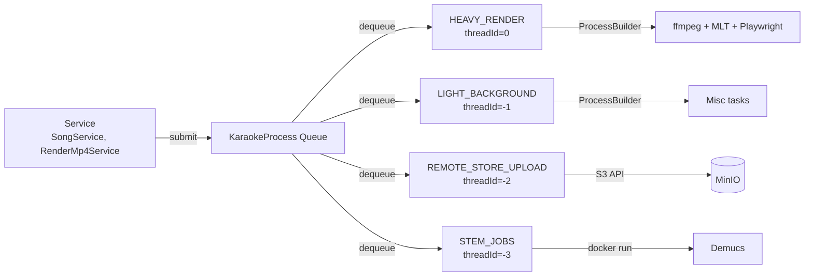

# Тема: Async-очередь (threadId lanes + priority)

> Drill-down по Async Queue из [L3-components.md](L3-components.md).

## Что показывает

Как устроена **асинхронная очередь задач** в Karaoke: как задачи попадают в
очередь, как исполняются (через `ProcessBuilder`), как парсится прогресс,
как ограничивается CPU.

## Диаграмма (Mermaid)



## ThreadId lanes

| Lane | threadId | Назначение | Примеры задач |
|------|----------|------------|----------------|
| **HEAVY_RENDER** | 0 | Тяжёлый рендер видео | `RENDER_MP4_LYRICS`, `RENDER_MP4_KARAOKE`, `RENDER_MP4_DEMO` |
| **LIGHT_BACKGROUND** | -1 | Лёгкие фоновые задачи | thumbnails, статистика, мелкие обновления |
| **REMOTE_STORE_UPLOAD** | -2 | Загрузка в MinIO | upload видео/превью |
| **STEM_JOBS** | -3 | Стем-сепарация (Demucs) | `DEMUCS_VOCALS`, `DEMUCS_ACCOMPANIMENT` |

`threadId = 0` означает «выполняется в основном потоке KaraokeProcess», что
**блокирует другие задачи в этом lane**. Поэтому HEAVY_RENDER — отдельный
lane с низким приоритетом.

## Приоритеты

Задачи внутри lane сортируются по `priority` (высший приоритет = меньше число).
`KaraokeProcess.submit()` принимает priority + threadId.

## ProcessBuilder — главные правила

### redirectErrorStream(true) ВСЕГДА

```kotlin
// ✅ ПРАВИЛЬНО
val pb = ProcessBuilder(cmd).redirectErrorStream(true)

// ❌ ЗАПРЕЩЕНО (буфер stderr ~64KB переполняется → блокировка)
val pb = ProcessBuilder(cmd).redirectErrorStream(false)
```

Это критичная ловушка: ffmpeg пишет warnings в stderr, буфер переполняется,
процесс блокируется на write(stderr). См. CONTRIBUTING.md и Q&A в AGENTS.md.

### Парсинг stdout

Прогресс парсится из stdout по регулярным выражениям:

| Tool | Pattern | Пример |
|------|---------|--------|
| ffmpeg | `time=HH:MM:SS.ms` | `time=00:01:23.45` |
| MLT (melt) | `NN%` | `50%` |
| Sheetsage | `NN%\|` | `45%|` |
| Demucs | `NN%` | `30%` |

## Ограничения CPU

CPU ограничивается **тремя слоями**:

1. **Docker `--cpus`** в `docker-compose.yml` (per-container limit).
2. **`MLT_CPU_LIMIT`** в `KaraokeProperties.kt` (per-render limit).
3. **`docker update`** во время работы (динамическое изменение).

Это предотвращает ситуацию, когда 4 параллельных рендера занимают все ядра
и блокируют админку.

## Код

- Очередь: `karaoke-app/src/main/kotlin/com/svoemesto/karaokeapp/KaraokeProcess.kt`
- Submit: `KaraokeProcess.submit(task, priority, threadId)`
- Задачи: `karaoke-app/src/main/kotlin/com/svoemesto/karaokeapp/KaraokeProcessRenderMp4*.kt`
- Свойства: `KaraokeProperties.kt` (CPU limits)

## Ловушки

- **redirectErrorStream(false)** — процесс блокируется.
- **Запуск 4+ тяжёлых рендеров параллельно** — UI висит.
- **Парсинг stdout без таймаута** — может зависнуть.
- **Игнорирование exit code** — задача «успешно завершилась» даже при ошибке.

## Связанные LiveDocs

- Domain: [processing.md](../domain/processing.md) (что рендерится)
- Architecture: [L3-components.md](L3-components.md) (Async Queue компонент)

## История

- Создан: 2026-08-14
- Последнее обновление: 2026-08-14