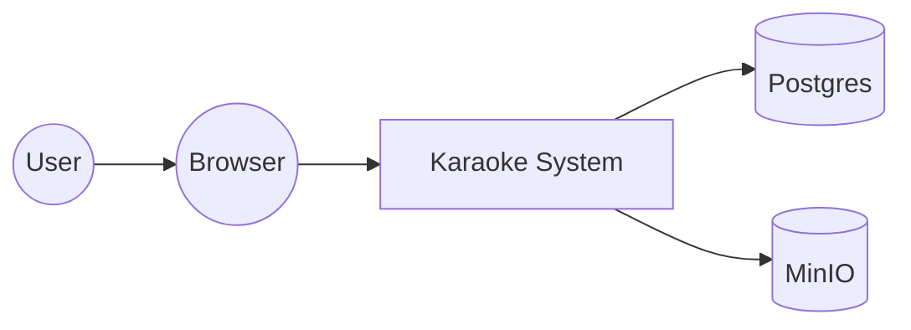

# C4 Level 1: System Context

> C4 диаграмма уровня 1 — показывает систему как чёрный ящик + внешних
> пользователей/системы.

## Что показывает

[1 абзац: какие вопросы отвечает эта диаграмма, кто пользуется системой,
с какими внешними системами взаимодействует]

## Диаграмма (Mermaid)

## Внешние системы / пользователи

### <Имя 1>
- **Назначение**: [1-2 строки]
- **Тип**: [внешняя система / пользователь / сервис]
- **Взаимодействие**: [как общается с Karaoke]

### <Имя 2>
[аналогично]

## Связи

- **User → Browser**: [HTTPS]
- **Browser → Karaoke**: [HTTPS, REST/SSE]
- **Karaoke → Postgres**: [JDBC, port 5432]
- **Karaoke → MinIO**: [S3 API, port 9000]

## Связанные LiveDocs

- Architecture: [L2-containers.md](L2-containers.md) — drill-down в контейнеры Karaoke.
- Domain: [catalog.md](../domain/catalog.md) | [publishing.md](../domain/publishing.md)

## История

- Создан: <YYYY-MM-DD>
- Последнее обновление: <YYYY-MM-DD>