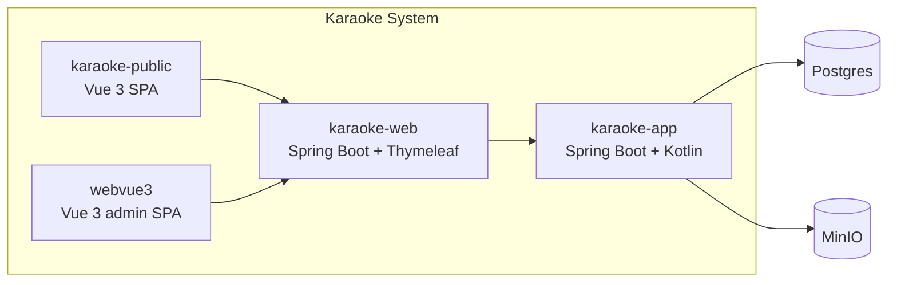

# C4 Level 2: Containers

> C4 диаграмма уровня 2 — показывает приложения и хранилища внутри Karaoke.

## Что показывает

[1 абзац: какие приложения работают, как они связаны друг с другом,
какие хранилища используют]

## Диаграмма (Mermaid)

## Контейнеры

### karaoke-web
- **Назначение**: [1-2 строки]
- **Технология**: Kotlin 1.x, Spring Boot, Thymeleaf
- **Ответственность**: публичный API + Thymeleaf legacy-страницы
- **Разворачивается**: прод

### karaoke-app
- **Назначение**: ядро — модели, MLT-генератор, очередь задач, LLM-поиск
- **Технология**: Kotlin 1.x, Spring Boot
- **Ответственность**: бизнес-логика, async-очередь, ML/интеграции
- **Разворачивается**: admin-машина (НЕ на проде)

### karaoke-public
- **Назначение**: публичный SPA с каталогом песен и плеером
- **Технология**: Vue 3 + Vite + Bootstrap 5
- **Ответственность**: classic/modern дизайн, локальный стейт через Vuex

### webvue3
- **Назначение**: админский SPA
- **Технология**: Vue 3 + Vite + Bootstrap-vue-next + Vuex
- **Ответственность**: управление каталогом, очередями, настройками

## Хранилища

### Postgres
- **Тип**: реляционная БД
- **Назначение**: все данные (песни, альбомы, пользователи, настройки)

### MinIO
- **Тип**: S3-compatible объектное хранилище
- **Назначение**: медиа (аудио, видео, изображения)

## Связи

- **karaoke-public → karaoke-web**: HTTPS, REST API
- **webvue3 → karaoke-web**: HTTPS, REST API (permitAll)
- **karaoke-web → karaoke-app**: in-process или отдельный процесс (admin)
- **karaoke-app → Postgres**: JDBC
- **karaoke-app → MinIO**: S3 API

## Связанные LiveDocs

- Architecture: [L1-system-context.md](L1-system-context.md) — drill-up.
- Architecture: [L3-components.md](L3-components.md) — drill-down в karaoke-app.

## История

- Создан: <YYYY-MM-DD>
- Последнее обновление: <YYYY-MM-DD>