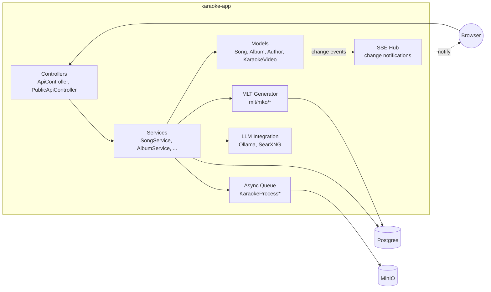

# C4 Level 3: Components (karaoke-app)

> C4 диаграмма уровня 3 — показывает компоненты внутри karaoke-app.

## Что показывает

[1 абзац: какие крупные модули внутри karaoke-app, как они общаются,
какие ответственности у каждого]

## Диаграмма (Mermaid)

## Компоненты

### Controllers
- **Назначение**: HTTP-эндпоинты (REST API + Thymeleaf)
- **Код**: `karaoke-app/src/main/kotlin/.../controller/`
- **Зависимости**: Services

### Services
- **Назначение**: бизнес-логика
- **Код**: `karaoke-app/src/main/kotlin/.../service/`
- **Зависимости**: Models, DB, Queue, LLM

### Models
- **Назначение**: доменные модели (KaraokeDbTable + recordhash)
- **Код**: `karaoke-app/src/main/kotlin/.../model/`
- **Зависимости**: JDBC

### MLT Generator
- **Назначение**: генерация MLT-проектов для караоке-видео
- **Код**: `karaoke-app/src/main/kotlin/.../mlt/`
- **Зависимости**: Models, ~150 параметров в KaraokeProperties

### Async Queue
- **Назначение**: длительные операции (ffmpeg, Demucs, Sheetsage)
- **Код**: `karaoke-app/src/main/kotlin/.../KaraokeProcess*.kt`
- **Зависимости**: ProcessBuilder, MinIO

### LLM Integration
- **Назначение**: Ollama + SearXNG (локальные ML-модели + поиск)
- **Код**: `karaoke-app/src/main/kotlin/.../llm/`
- **Зависимости**: Ollama HTTP API, SearXNG HTTP API

### SSE Hub
- **Назначение**: change notifications (SSE)
- **Код**: `karaoke-app/src/main/kotlin/.../sse/`
- **Зависимости**: Models (event publisher), Browser (subscriber)

## Связи

- **Controllers ↔ Services**: in-process вызовы.
- **Services ↔ Models**: in-process (recordhash-diff для sync).
- **Services ↔ MLT**: MLT-генератор вызывается при сохранении Song.
- **Services ↔ Queue**: enqueue при сохранении, прогресс через stdout.
- **Models ↔ SSE**: события публикуются при save() (через KaraokeDbTable).
- **SSE ↔ Browser**: HTTP/2 long-poll, JSON payload.

## Связанные LiveDocs

- Architecture: [L2-containers.md](L2-containers.md) — drill-up.
- Domain: [catalog.md](../domain/catalog.md) | [processing.md](../domain/processing.md)
- Features: [182-...](../features/182-editor-self-assign-tasks.md) | ...

## История

- Создан: <YYYY-MM-DD>
- Последнее обновление: <YYYY-MM-DD>