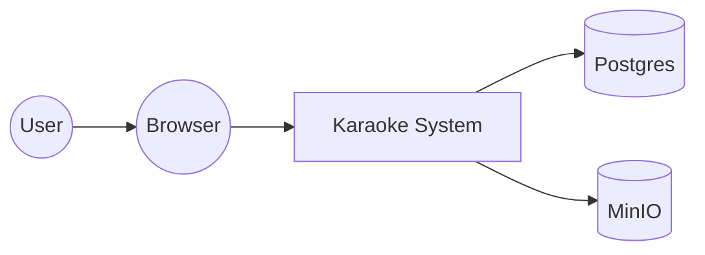
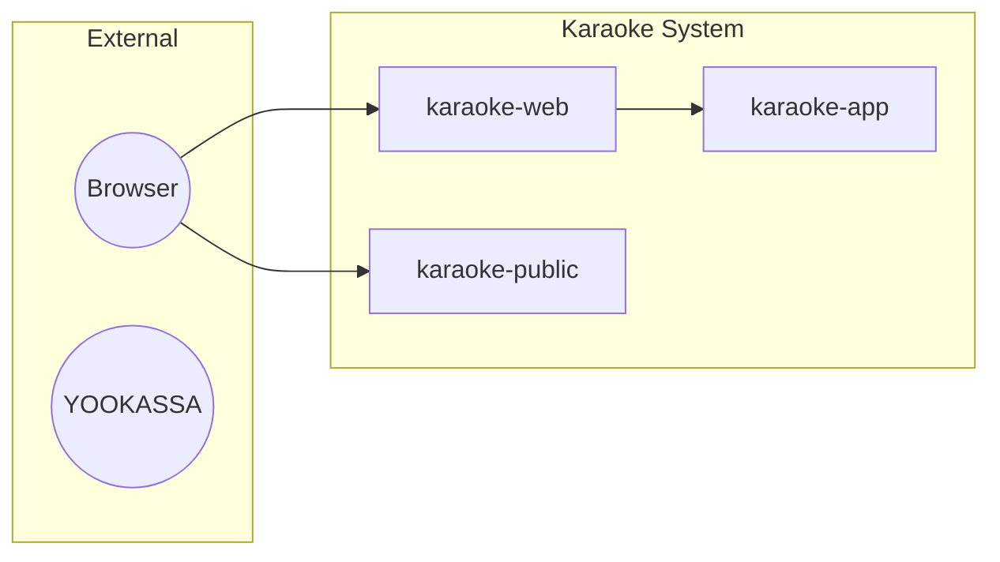

# C4 Level Template (Contract)

**Назначение**: компактный шаблон для `livedocs/architecture/L<n>-*.md`
(L1/L2/L3) и `livedocs/architecture/<topic>.md`.

## Frontmatter

```yaml
---
status: Active
slug: L<n>-<topic>
type: c4-level       # для L1/L2/L3
# или
type: topic          # для тематических (data-sync, queue-lanes, ...)
level: L1            # обязательно для c4-level
related:
  - ../domain/<context>.md
  - ../features/<NNN-slug>.md
---
```

## Body

```markdown
# C4 Level <N>: <Заголовок>

> C4 диаграмма уровня N. Показывает [что именно — system context / containers
> / components].

## Что показывает

[1 абзац: какие вопросы отвечает эта диаграмма, на каком уровне абстракции]

## Диаграмма (Mermaid)

\`\`\`mermaid
[Диаграмма в формате Mermaid — C4-PlantUML-стиль или C4-Mermaid]
\`\`\`

## Компоненты / Контейнеры / Системы

### <Имя 1>

- **Назначение**: [1-2 строки]
- **Технология**: [Kotlin/Spring Boot, Vue 3, etc.]
- **Ответственность**: [что делает, за что отвечает]

### <Имя 2>

[аналогично]

## Связи

- **<A> → <B>**: [протокол, формат, частота]
- **<B> → <C>**: [аналогично]

## Связанные LiveDocs

- Domain: [catalog.md](../domain/catalog.md) | [processing.md](../domain/processing.md)
- Features: [182-...](../features/182-...) | [184-...](../features/184-...)

## История

- Создан: <YYYY-MM-DD>
- Последнее обновление: <YYYY-MM-DD>
```

## Конвенции для C4 (Simon Brown)

### L1 — System Context

- Показывает **Karaoke** как чёрный ящик + внешних пользователей/системы.
- Внешние системы: браузер, MinIO, Postgres, Ollama, Sheetsage, SearXNG,
  YOOKASSA, VK.
- Тип диаграммы: `C4Context`.

### L2 — Containers

- Показывает **приложения и хранилища** внутри Karaoke.
- Контейнеры: `karaoke-app`, `karaoke-web`, `karaoke-public` (Vue SPA),
  `webvue3` (Vue SPA), Postgres, MinIO, Redis (не используется).
- Тип диаграммы: `C4Container`.

### L3 — Components

- Показывает **компоненты внутри karaoke-app**.
- Компоненты: Model layer, MLT layer, Queue layer (`KaraokeProcess*`),
  LLM layer, SSE hub, MLT generator.
- Тип диаграммы: `C4Component`.

### Topic (не C4 уровень)

Тематические архитектурные документы для drill-down по конкретной теме:
- `data-sync.md` — LOCAL ↔ SERVER синхронизация (SyncRegistry, recordhash).
- `queue-lanes.md` — async-очередь (KaraokeProcess*, threadId lanes, priority).
- `mlt-pipeline.md` — MLT-генератор (mko, ~150 параметров).
- `dual-db-access.md` — сырой JDBC (KaraokeConnection, Connection.local/remote/virtual).

## Конвенции

- **Размер**: ≤ 2 страницы (≤ 80 строк) для L1/L2/L3, ≤ 3 стр. (≤ 120 строк) для topic.
- **Mermaid-блок** — обязателен (минимум 1 диаграмма).
- **Что показывает** — обязательная секция (1 абзац).
- **Связи** — обязательная секция (минимум 2 связи).

## Validation

- Наличие frontmatter с `status`, `slug`, `type: c4-level` (или `topic`).
- Для `c4-level`: наличие `level: L1|L2|L3`.
- Наличие Mermaid-блока (строка начинается с `` ```mermaid ``).
- Наличие секции `## Что показывает`.
- Наличие секции `## Связи`.
- Размер ≤ 80 (L1/L2/L3) или ≤ 120 (topic) строк.

## Mermaid-стиль для C4

В Mermaid пока нет нативного C4-стиля (как в Structurizr/PlantUML), поэтому
используются 2 подхода:

### Подход A: `flowchart` (простой)



### Подход B: graph LR с подграфами



В first slice используется **подход A** (проще). Переход на полный C4-Mermaid
(когда появится библиотека) — в Pass 2+.